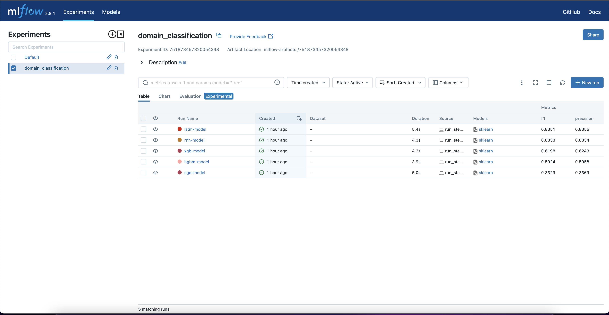
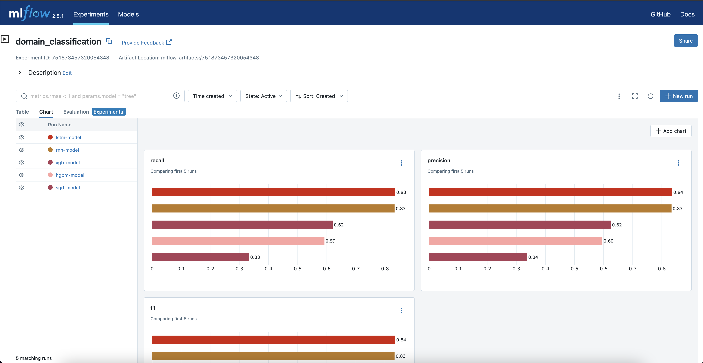
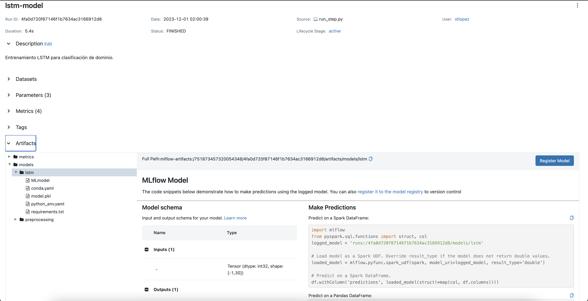

# Domain Classification

El objetivo del Challenge es productivizar un modelo de ML. Por ende el enfoque fue construir un MVP de un modelo de clasificación, se podría entrenar un mejor modelo utilizando estrategias de Transfer Learning en las redes neuronales recurrentes para aprovechar bondades de Embeddings como Wor2Vec, GloVe, BERT, entre otros.

Un proyecto de Machine Learning, tiene diferentes etapas, por ejemplo:
* **Design:** Esta etapa busca responder algunas preguntas como:
  * ¿Cuál es el valor agregado de la iniciativa de ML?
  * ¿Cuáles son los requerimientos de negocio?
  * ¿Con qué métricas vamos a evaluar el exito del proyecto?
  * Datos ¿Donde están? ¿Cómo los preprocesamos?
* **Development:** Esta etapa es más de desarrollo y acá se puede trabajar en:
  * Feature Engineering.
  * Experiment Tracking.
  * Model training & evaluation.
* **Deployment:** En la etapa de despliegue es sumamente importante generar un ambiente óptimo y con todas las dependencias. En esta etapa se debe tener en cuenta:
  * Entorno de ejecución.
  * Arquitectura de microservicios.
  * Pipeline CI/CD.
  * Monitoreo y re-entrenamiento.


## Estructura del Proyecto

```plaintext
├── app
│   ├── builders
│   ├── config
│   ├── data
│   ├── modeling
│   ├── preprocessing
│   ├── steps
│   └── utilities
├── notebooks
├── Dockerfile
├── estructura_proyecto.txt
├── inference_logs.txt
├── poetry.lock
├── pyproject.toml
├── README.md
└── training_logs.txt
```

### Módulos

#### 1. builders

El módulo `builders` contiene funciones y clases que definen hypermodels para el entrenamiento utilizando optimización de hiperparámetros bayesianos.

#### 2. config

El módulo `config` instancia variables de configuración para el proyecto.

#### 3. data

La carpeta `data` contiene los set de datos partidos para entrenar, validar o testear los modelos.

#### 4. modeling

En el módulo `modeling`, se encuentra una clase que facilita la evaluación de modelos de clasificación. Incluye métricas principales y la matriz de confusión. Además también contiene un módulo que instancia el modelo con los hiperparametros a optimizar en el entrenamiento.

#### 5. preprocessing

El módulo `preprocessing` contiene funciones relacionadas con la preparación de datos de texto antes del entrenamiento.

#### 6. steps

El módulo `steps` contiene un script principal del proyecto. Basado en el tipo de ejecución, realiza entrenamientos de modelos o predicciones en batch.

#### 7. utilities

El módulo `utilities` incluye funciones útiles para tareas repetitivas y generales en el proyecto.

### Archivos Adicionales

- `notebooks`: Directorio que contiene Jupyter Notebooks para análisis exploratorio o prototipado.
- `Dockerfile`: Archivo de configuración para la creación de contenedores Docker.
- `estructura_proyecto.txt`: Descripción de la estructura del proyecto.
- `inference_logs.txt`: Archivo de registros para la predicción en batch.
- `poetry.lock` y `pyproject.toml`: Archivos relacionados con la gestión de dependencias utilizando Poetry.
- `training_logs.txt`: Archivo de registros cuando se ejecuta el entrenamiento.

# Development

## Preprocesamiento de Texto

En la parte de preprocesamiento de texto, se utilizaron dos técnicas principales:

* **Tokenizer**:

    El tokenizer se utiliza para dividir el texto en palabras (tokens). Convierte el texto en una secuencia de números enteros, donde cada número entero representa una palabra en el vocabulario.

* **Pad sequences**:
  
    Se utiliza para igualar la longitud de todas las secuencias de texto. Añade padding (relleno) a las secuencias más cortas para que todas tengan la misma longitud, lo que es necesario para alimentar los datos al modelo.

##  Algoritmos entrenados

Se entrenaron 5 algoritmos: **SGD**, **HistGradientBoosting**, **XGBoost**, **RNN** y **LSTM**. Si bien la literatura y muchos trabajos prácticos evidencian que los algoritmos que suelene funcionar mejor para clasificar texto son las redes neuronales, sobretodo las arquitecturas de redes neuronales recurrentes por su capacidad de trabajar con secuencias. Vemos con los resultados que efectivamente las redes RNN y LSTM tienen más capacidad de clasificar en un dominio dado el texto de un item que se oferta en el MarketPlace.

##  Métricas de Evaluación
Se utilizaron las siguientes métricas de clasificación para evaluar los modelos:

* **Precision**: Mide la proporción de instancias positivas correctamente clasificadas entre todas las instancias clasificadas como positivas.
* **Recall**: Mide la proporción de instancias positivas correctamente clasificadas entre todas las instancias que son realmente positivas.
* **F1 Score**: Es la media armónica de precision y recall. Es útil cuando hay un desequilibrio entre las clases.
* **Accuracy**: Mide la proporción de instancias correctamente clasificadas entre todas las instancias.

El mejor modelo se seleccionó utilizando el **_F1 Score_**. Además, en la optimización con validación cruzada, se utilizó el **_Accuracy_** como métrica de optimización debido al equilibrio en el conjunto de datos.

## Experiment Tracking

Se utilizó MLflow para realizar un seguimiento de los experimentos:

* **Registro de Métricas:** Las principales métricas, como precision, recall, f1_score y accuracy, se registraron con MLflow.
* **Parámetros Óptimos:** Los parámetros óptimos de los modelos se guardaron en MLflow para su referencia.
* **Modelos Guardados:** Los modelos entrenados se guardaron en el servidor de MLflow para su posterior uso en predicciones batch sobre nuevos conjuntos de datos.

Para visualizar los experimentos con MLflow, ejecuta el siguiente comando:
```
mlflow ui --host 0.0.0.0 --port 2020
```

En el navegador `http://0.0.0.0:2020` para ver el resultado de los experimentos. Abre una página como se muestra en la siguiente imagen:



Podemos comparar las métricas de evaluación entre cada uno de los modelos:



Y podemos ver metadatos de cada uno de los modelos, como los parámetros, las métricas e incluso artefactos. Para este caso se guardaron como artefactos la matriz de confusión sobre el set de test, el modelo con todas sus dependencias y los objetos que se ajustaron en el entrenamiento para poder aplicar las mismas transformaciones sobre datos nuevos y evitar un Data Leakeage. Un zoom sobre el modelo se ve así:



# Deployment

## Gestion de Dependencias con Poetry
Para garantizar la generación del runtime environment y gestionar las dependencias, se utiliza Poetry. Poetry es una herramienta de gestión de dependencias y empaquetado para proyectos de Python.

### Instalación de Dependencias
Para instalar las dependencias del proyecto, ejecuta:

````
poetry install
````

Esto creará el entorno virtual y descargarán las dependencias especificadas en el archivo pyproject.toml.

### Actualización de Dependencias
Si necesitas actualizar las dependencias, ejecuta:

````
poetry update
````

### Generación del Environment

Para generar el archivo requirements.txt con las dependencias exactas, ejecuta:

```
poetry export --dev -f requirements.txt --output requirements.txt
```
Este archivo puede ser utilizado para desplegar el mismo ambiente en otros entornos.

## Arquitectura de microservicios

Se consideró una arquitectura de microservicios para aprovechar sus beneficios. Con este enfoque en mente, se pretendió construir un contenedor Docker que empaqueta toda la aplicación y ejecuta un entrypoint.

### Entrypoint
El entrypoint determina si la ejecución es para entrenamiento (`train`) o predicción (`prediction`). Dependiendo de la opción seleccionada:

* **Entrenamiento** (`train`): Realiza todo el proceso de entrenamiento, seguimiento y evaluación de los modelos en el conjunto de test.
* **Predicción** (`predict`): Realiza una predicción por lotes en un conjunto de datos "nuevo". Utiliza los artefactos de preprocesamiento para preparar el texto y pasa los datos al mejor modelo de todas las ejecuciones.

Esta estructura facilita la implementación de la arquitectura de microservicios y el escalado de componentes específicos según sea necesario.

* **Nota:** Se tuvieron problemas con la ejecución de Docker, por lo que se ejecutaron los scripts en la máquina local aprovechando poetry. Para el entrenamiento:

```
poetry run python app/steps/run_step.py train "http://localhost:2020" "domain_classification"
```

Se puede observar los logs del entrenamiento en el archivo `training_logs.txt`. Mientras que si queremos hacer la predicción:

```
poetry run python app/steps/run_step.py prediction "http://localhost:2020" "domain_classification"
```

Se puede observar los logs de la inferencia o predicción en el archivo `inference_logs.txt`.

El script recibe tres argumentos, donde el primero indica si debe hacer el entrenamiento o predicción, la uri de tracking y el nombre del experimento. Estos parámetros se usan de manera diferente dependiendo de la ejecución:

* `train`
  * El argumento `tracking_uri` sirve para definir donde se va a guardar el experimento, donde se van a guardar los parámetros, métricas, artefactos y modelos.
  * El argumento `experiment_name` es el nombre del experimento que se va a crear suponiendo que es nuevo o reutilizar para guardar.
* `prediction`:
  * El argumento `tracking_uri` sirve para definir en que servidor está todos los artefactos y modelos guardados para usar en **"producción"**.
  * El argumento `experiment_name` es el nombre del experimento se van a buscar todas las ejecuciones.

# 

## Monitoreo

Otra parte muy importante, que no se abordó es el monitoreo, es esencial tener un sistema de monitoreo para garantizar el rendimiento, la estabilidad y la seguridad del modelo. Algunas consideraciones son:

1. Rendimiento del modelo:
   * Tiempo de inferencia (predicción).
   * Recursos del sistema.
2. Estabilidad del sistema:
   * Disponibilidad.
   * Errores.
3. Seguridad:
   * Análisis de vulnerabilidades.
   * Monitoreo de actividades inusuales.

Por otro lado, en el mismo sentido de monitoreo, está el monitoreo más enfocado a la degradación de un modelo por algunos motivos:

1. **Data Drift**: Ocurre cuando hay cambios en la distribución de los datos de entrada.
2. **Concept Drift**: Ocurre cuando hay cambios entre la relación de entrada y salida del modelo.
3. **Output Drift**: Es el cambio en la distribución de salida del modelo, puede indicar problemas relacionado a los dos anteriores o depende de la problema puede no ser un problema.

Es importante tener ese monitoreo robusto para tener más información para decidir si se debe re-entrenar o no.


